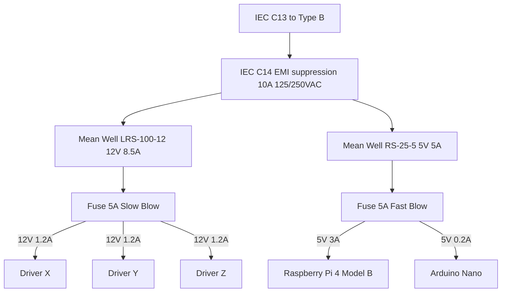

# Automation-Incubator-Microscope

## Mechanical Documentation
This section summarizes the engineering analysis and results for a custom linear stage intended for microscopy applications.

### Kinematic & Motion Analysis
#### Degrees of Freedom (DOF):

  

- X-axis: 1 translational (stacked system)
- Y-axis: 1 translational
- Z-axis: 1 translational 

All axes exhibited no unintended rotations or free translations, confirming proper constraint and assembly of the stage.

#### Lead Screw Motion:
- Lead screw pitch: 1 mm/rev
- Stepper motor: 200 steps/rev, full-step (x,y,z axis)
- Theoretical linear resolution:

$$
\begin{aligned}
\text{Resolution} &= \frac{\text{Lead Screw Pitch}}{\text{Steps per Revolution}} \\
                  &= \frac{1 \text{mm}}{200 \times 1} \\
                  &= 0.005 \text{mm} \\
                  &= 5 \mu\text{m}
\end{aligned}
$$

- Distance between plates = 9 mm
- Theoretical required number of motor pulses:

$$
\begin{aligned}
\text{Required Steps}
&= \frac{\text{Travel Distance}}{\text{Resolution}} \\
&= \frac{9 \text{mm}}{5 \mu\text{m}} \\
&= \frac{9000 \mu\text{m}}{5 \mu\text{m}} \\
&= 1800 \text{steps}
\end{aligned}
$$

#### Interference Analysis:

  

The interference analysis reports several interferences; however, these are not physically relevant in real-world assembly. The detected interferences occur within precision components such as linear rails and threaded regions of the KFL08 bearing, which are intentionally modeled with overlapping geometry in CAD. Therefore, no actual collisions or functional interferences are present in the final design.

### Structural Rigidity
#### Stage Plate Analysis (Static Load):
- Load applied: Gravity force only
- Gravity direction: Vertical (−Z axis)
- Acceleration: 9.81 m/s²

##### A. PLA-CF

  
  
  
  

- The displacement contour shows dominant green regions on the structure.
- These green regions correspond to a displacement range of approximately 0.0349 – 0.05235 mm.
- The deformation is mainly concentrated around:
  - The upper stage plate
  - The area near the stepper motor mounting
- This indicates that the self-weight of the stepper motor is the dominant contributor to the overall deformation.
- Due to the lower elastic modulus of PLA-CF, the structure exhibits global sagging under gravity-only loading.

##### B. Aluminum 6061

  
  
  
  

- The displacement contour is dominated by dark blue regions.
- Dark blue corresponds to near-zero displacement (<1 µm, minimum value).
- This indicates that the structure experiences negligible deformation under gravity-only loading.
- The higher stiffness of Aluminum 6061 effectively resists bending caused by the self-weight of the system, including the stepper motor.

##### Summary of Stage Plate Analysis

| Parameter | PLA-CF | Aluminum 6061 |
| :--- | :--- | :--- |
| Stiffness | Moderate | Very High |
| Max Deflection | ~54 µm | <1 µm |
| Structural Rigidity | Exhibits global sagging | Negligible bending |
| Focus Reliability | Not suitable for high magnification | Suitable for precision imaging |
| Engineering Verdict | Acceptable for non-critical parts | Recommended for structural components |

#### Motor Bracket Analysis:
##### A. X Motor Bracket
###### Previous Version

  
  
  
  

###### New Version

  
  
  
  

##### B. Y Motor Bracket
###### Previous Version

  
  
  
  

###### New Version

  
  
  
  

##### C. Z Motor Bracket
###### Previous Version

  
  
  
  

###### New Version

  
  
  
  

##### Summary of Motor Bracket Analysis

### Vibration Consideration
sip

### Thermal Consideration

  
  
  
  

### Drawing & Tolerance
sip

## Electrical Documentation
### System Architecture
#### Theoritical Approach
Fuse sizing rule

#### Power Distribution Architecture

