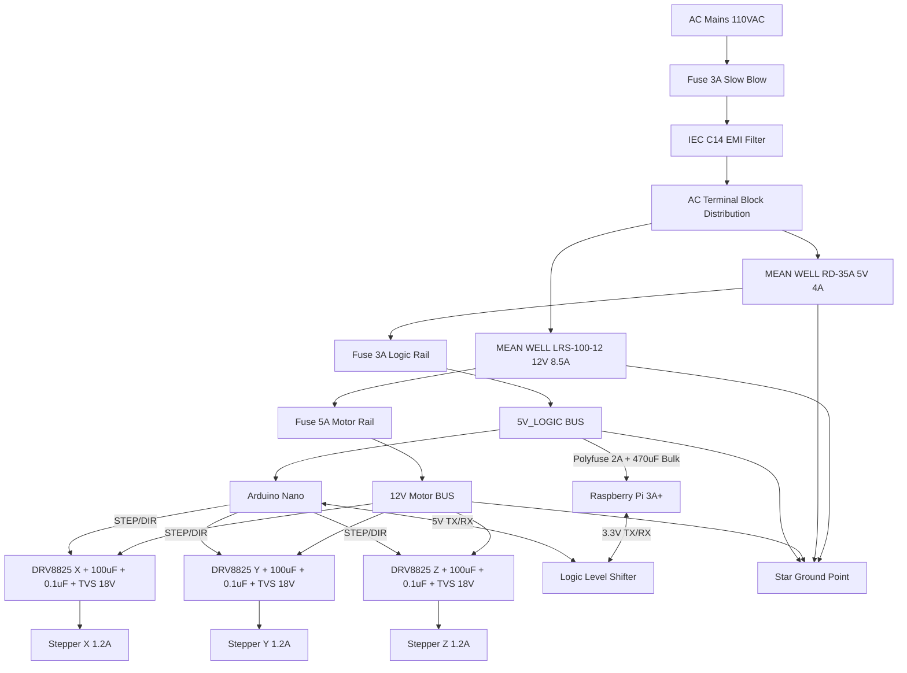

# 🔬 Automation Incubator Microscope

<div align="center">


**A custom 3-axis automated linear stage for microscopy applications, developed at NCKU.**

[Overview](#overview) · [Mechanical](#-mechanical-documentation) · [Electrical](#-electrical-documentation) · [Getting Started](#-getting-started) · [Contributing](#-contributing)

</div>

---

## Overview

This project documents the development of a custom motorized XYZ linear stage integrated with an incubator microscope setup. The system enables automated sample positioning for long-term live-cell imaging experiments.

| Feature | Specification |
| :--- | :--- |
| Axes | X, Y, Z (independent translational) |
| Linear Resolution | 5 µm/step (full-step) |
| Travel (Z) | 9 mm |
| Motor Driver | DRV8825 |
| Controller | Arduino Nano + Raspberry Pi 3A+ |
| Primary Material | PLA-CF / Aluminum 6061 |

---

## 🔩 Mechanical Documentation

### Kinematic & Motion Analysis

#### Degrees of Freedom (DOF)

<p align="center">
  
</p>

Each axis provides exactly 1 translational DOF with no unintended rotational or parasitic motion, confirming proper constraint and assembly.

| Axis | DOF Type | Notes |
| :--- | :--- | :--- |
| X | 1 Translational | Stacked system |
| Y | 1 Translational | — |
| Z | 1 Translational | Focus axis |

#### Lead Screw Motion

- **Lead screw pitch:** 1 mm/rev  
- **Stepper motor:** 200 steps/rev, full-step (all axes)

**Theoretical linear resolution:**

$$
\text{Resolution} = \frac{\text{Lead Screw Pitch}}{\text{Steps per Revolution}} = \frac{1\ \text{mm}}{200 \times 1} = 0.005\ \text{mm} = 5\ \mu\text{m}
$$

**Required steps for full Z travel (9 mm gap between plates):**

$$
\text{Required Steps} = \frac{9\ \text{mm}}{5\ \mu\text{m}} = \frac{9000\ \mu\text{m}}{5\ \mu\text{m}} = 1800\ \text{steps}
$$

#### Interference Analysis

<p align="center">
  
</p>

> ⚠️ **Note:** The interference analysis flags several overlaps in the CAD model. These occur within intentionally modeled precision components (linear rails, KFL08 bearing threaded regions) and are not physically relevant in real-world assembly. No functional collisions exist in the final design.

---

### Structural Rigidity

Static load analysis was performed on the stage plate under gravity only (−Z, 9.81 m/s²). Two materials were evaluated: **PLA-CF** and **Aluminum 6061**.

#### A. PLA-CF

<p align="center">
  
  
  
  
</p>

- Displacement contour dominated by **green regions** (~0.035–0.052 mm range)
- Deformation concentrated at upper stage plate and stepper motor mounting area
- Stepper motor self-weight is the dominant contributor to deflection
- Global sagging observed due to lower elastic modulus of PLA-CF

#### B. Aluminum 6061

<p align="center">
  
  
  
  
</p>

- Displacement contour dominated by **dark blue regions** (<1 µm)
- Negligible deformation under gravity-only loading
- High stiffness effectively resists bending from stepper motor self-weight

#### Material Comparison Summary

<div align="center">

| Parameter | PLA-CF | Aluminum 6061 |
| :--- | :---: | :---: |
| Stiffness | Moderate | Very High |
| Max Deflection | ~54 µm | <1 µm |
| Structural Rigidity | Global sagging | Negligible bending |
| Focus Reliability | ⚠️ Not suitable for high magnification | ✅ Suitable for precision imaging |
| Verdict | Acceptable for non-critical parts | **Recommended for structural parts** |

</div>

---

### Motor Bracket Analysis

Structural analysis was conducted on motor brackets for all three axes. Each bracket was evaluated in two design iterations.

#### A. X Motor Bracket

<details>
<summary>Previous Version</summary>
<p align="center">
  
  
  
  
</p>
</details>

<details>
<summary>New Version</summary>
<p align="center">
  
  
  
  
</p>
</details>

#### B. Y Motor Bracket

<details>
<summary>Previous Version</summary>
<p align="center">
  
  
  
  
</p>
</details>

<details>
<summary>New Version</summary>
<p align="center">
  
  
  
  
</p>
</details>

#### C. Z Motor Bracket

<details>
<summary>Previous Version</summary>
<p align="center">
  
  
  
  
</p>
</details>

<details>
<summary>New Version</summary>
<p align="center">
  
  
  
  
</p>
</details>

> 📝 **Motor Bracket Summary:** *(to be completed — add max stress, safety factor, and design change rationale for each axis)*

---

### Vibration Consideration

> 🚧 **In progress** — modal analysis and vibration isolation strategy to be documented.

---

### Thermal Consideration

Thermal images of each stepper motor and the well plate under operating conditions:

<p align="center">
  
  
  
  
</p>

> 📝 **Add here:** peak temperatures recorded, acceptable operating range, any heat mitigation measures taken.

---

### Drawing & Tolerance

> 🚧 **In progress** — engineering drawings and GD&T specifications to be added.

---

## ⚡ Electrical Documentation

### System Architecture

#### Electrical Block Diagram


```mermaid
flowchart TD

%% ================= AC FRONT END =================
A[AC Mains 110VAC] --> B[Fuse 3A Slow Blow]
B --> C[IEC C14 EMI Filter]
C --> TB[AC Terminal Block Distribution]

%% ================= PSU DISTRIBUTION =================
TB --> PSU1[MEAN WELL LRS-100-12 12V 8.5A]
TB --> PSU2[MEAN WELL RD-35A 5V 4A]

%% ================= MOTOR DOMAIN =================
PSU1 --> FM[Fuse 5A Motor Rail]
FM --> M12V[12V Motor BUS]

M12V --> SD1[DRV8825 X + 100uF + 0.1uF + TVS 18V]
M12V --> SD2[DRV8825 Y + 100uF + 0.1uF + TVS 18V]
M12V --> SD3[DRV8825 Z + 100uF + 0.1uF + TVS 18V]

SD1 --> SM1[Stepper X 1.2A]
SD2 --> SM2[Stepper Y 1.2A]
SD3 --> SM3[Stepper Z 1.2A]

%% ================= LOGIC DOMAIN =================
PSU2 --> FL[Fuse 3A Logic Rail]
FL --> L5V[5V_LOGIC BUS]

L5V --> |Polyfuse 2A + 470uF Bulk| PI[Raspberry Pi 3A+]
L5V --> ARD[Arduino Nano]

%% ================= LEVEL SHIFT =================
PI <-->|3.3V TX/RX| LS[Logic Level Shifter]
ARD <-->|5V TX/RX| LS

%% ================= CONTROL =================
ARD -->|STEP/DIR| SD1
ARD -->|STEP/DIR| SD2
ARD -->|STEP/DIR| SD3

%% ================= GROUND STRATEGY =================
PSU1 --> SG[Star Ground Point]
PSU2 --> SG
M12V --> SG
L5V --> SG
```

#### Component List

| Component | Part Number | Specification | Quantity |
| :--- | :--- | :--- | :---: |
| PSU (Motor) | MEAN WELL LRS-100-12 | 12V, 8.5A | 1 |
| PSU (Logic) | MEAN WELL RD-35A | 5V, 4A | 1 |
| Motor Driver | DRV8825 | 1/32 microstepping | 3 |
| Stepper Motor | — | 1.2A, 200 steps/rev | 3 |
| MCU | Arduino Nano | 5V logic | 1 |
| SBC | Raspberry Pi 3A+ | 3.3V logic | 1 |
| Level Shifter | — | 3.3V ↔ 5V | 1 |
| EMI Filter | IEC C14 | — | 1 |

> 📝 **Theoretical approach section:** *(to be completed — add signal flow description, control loop explanation, communication protocol)*

---

## 💻 Software Documentation

> 🚧 **In progress** — firmware (Arduino) and control software (Raspberry Pi) to be documented.

### Planned Structure

```
software/
├── firmware/           # Arduino Nano — step/dir control
│   └── main.ino
├── control/            # Raspberry Pi — high-level control
│   ├── main.py
│   └── serial_comm.py
└── calibration/        # Stage calibration scripts
    └── calibrate.py
```

---

## 🚀 Getting Started

> 🚧 **In progress** — assembly guide and setup instructions to be added.

### Prerequisites

- Arduino IDE ≥ 2.x
- Python ≥ 3.9
- Raspberry Pi OS (64-bit)

### Quick Start

```bash
# Clone the repository
git clone https://github.com/AlvinOctaH/Automation-Incubator-Microscope.git
cd Automation-Incubator-Microscope

# Install Python dependencies
pip install -r requirements.txt

# Flash Arduino firmware
# Open firmware/main.ino in Arduino IDE and upload to Nano
```

---

## 📁 Repository Structure

```
Automation-Incubator-Microscope/
├── src/                    # Images and media assets
├── mechanical/             # CAD files and FEA results
│   ├── stage-plate/
│   ├── motor-brackets/
│   └── drawings/
├── electrical/             # Schematics and BOM
├── software/               # Firmware and control scripts
├── docs/                   # Additional documentation
└── README.md
```

---

## 🗺️ Roadmap

- [x] Kinematic & motion analysis
- [x] Structural rigidity analysis (stage plate)
- [x] Motor bracket FEA (X, Y, Z)
- [x] Electrical architecture diagram
- [ ] Vibration analysis
- [ ] Engineering drawings & tolerances
- [ ] Firmware documentation
- [ ] Control software documentation
- [ ] Assembly guide
- [ ] Calibration procedure

---

## 👤 Author

**Alvin Octa H**  
Internship @ National Cheng Kung University (NCKU)  
Department of *(your department)*  

---

## 📄 License

This project is licensed under the MIT License — see the [LICENSE](LICENSE) file for details.

---

<div align="center">
<sub>Built with ☕ during internship at NCKU · Taiwan</sub>
</div>
